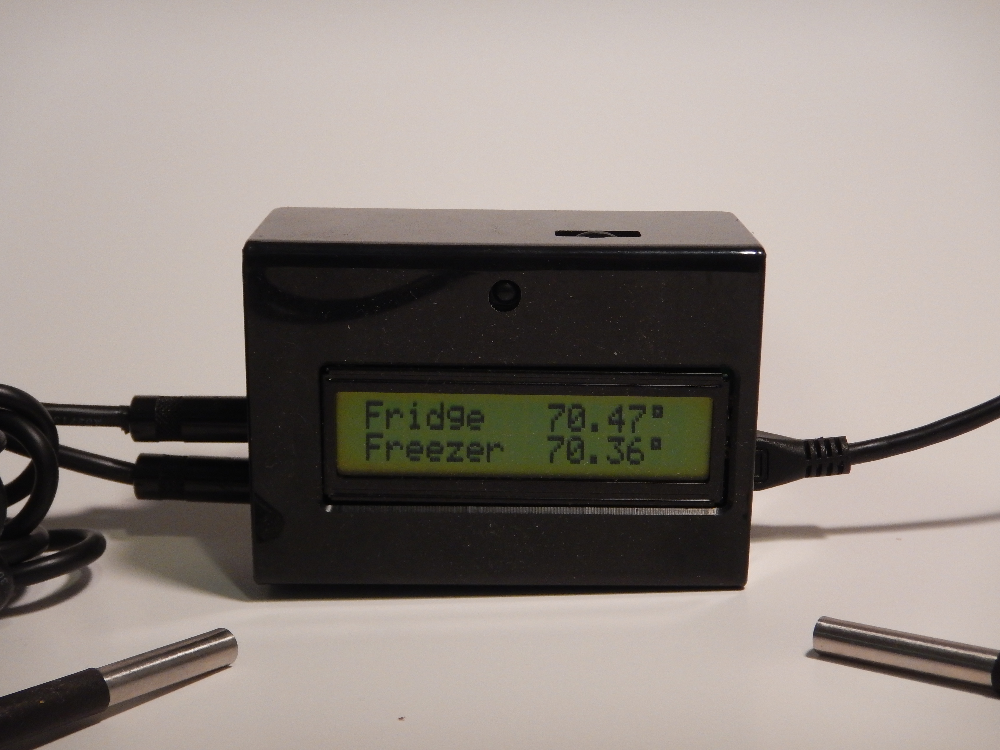

# TemperatureMonitor

This is a python script to monitor refrigerator and freezer temperatures. However, it can be adapted to monitor any temperatures for anything. It is designed to run on a [Raspberry Pi](https://www.raspberrypi.org).  Development was done on a Raspberry Pi 3 Model B and the implementation uses is a Raspberry Pi Zero running Raspbian Jessie Lite or Stretch Lite.  It can be configured with separate temperature ranges for the refrigerator and freezer.  Any out of range detections, as well as, nightly(midnight) status of current temperatures will be sent to a configurable e-mail address using Gmail's SMTP Server.  The range alert messages will only be sent once every 24 hours.  You must have a valid Gmail account and your google account "Sign-in & security" settings for "Allow less secure apps:" set to ON.

If you are new to the Raspberry PI, I suggest starting with the Raspberry Pi 3 Model B and the latest full version of Raspbian.  The Raspberry Pi Zero will require soldering on a header to the GPIO.  Regardless, some soldering is required.

[](https://opensource.org/licenses/MIT)

## Credits

This project (hardware and software) is based on a project by Tim Massaro he did for Channel One Food Bank.  You can find details [here](http://tinyurl.com/z54slkr).  Details on wiring up the DS18B20 temperature sensors can found in this [tutorial](http://tinyurl.com/on5tpdr).

## Hardware and parts

[Raspberry Pi 3 Model B](http://tinyurl.com/zrbyx6s), [Raspberry Pi Zero](https://www.adafruit.com/products/2817), or [Raspberry PI Zero W](https://www.adafruit.com/product/3410)  
8GB SD card  
[PiFace Control and Display LCD](http://www.piface.org.uk/products/piface_control_and_display/)  
2 [Waterproof DS18B20 Digital temperature sensor](https://www.adafruit.com/product/381) with 4.7k resistor  
[PiFace Control and Display Case](https://tinyurl.com/y8uynxh4)  
[Edimax EW-7811Un Wi-Fi USB adaptor](http://tinyurl.com/htkpvmb)  
This adaptor meets Raspberry Pi Zero low power USB requirements.  
Wi-Fi adaptor not needed if using the Raspberry Pi 3 or Raspberry Pi Zero W.  
2 [3.5mm stereo headphone jacks](http://tinyurl.com/h4pugfg)  
2 [3.5mm stereo headphone plugs/connectors](http://tinyurl.com/hmeju6f)

## Tools and supplies

* Soldering iron
* Resin core solder
* Wire stripper
* Wire cutter
* 22 gauge solid hookup wire

## Install Raspbian or Raspbian Lite

[Raspbian Download Page](https://www.raspberrypi.org/downloads/raspbian/)  
[Raspbian Install Instructions](http://tinyurl.com/pxmle57)  

## Setup

There are plenty of websites with instructions for setting up your Raspberry Pi and getting connected to the internet vi Wi-Fi.  Use you favorite internet search engine to get started.  I also
suggest running raspi-config and change the hostname under `Advanced Options`.  I renamed
mine to `tempmonitor`.

## Install and update modules

* Update Raspbian

```bash
sudo apt-get update
sudo apt-get upgrade
```

* Install/update python 3 and python GPIO library

```bash
sudo apt-get install python3 python3-pip python-dev
sudo pip3 rpi.gpio
```

* Enable SPI

```bash
sudo raspi-config
Select "Advanced Options"
Select "SPI"
Select "Yes"
Select "Ok"
Select "Finish"
```

* Enable [1-Wire](https://en.wikipedia.org/wiki/1-Wire) support

```bash
sudo nano /boot/config.txt
```

Add the following line and save

```bash
dtoverlay=w1-gpio
```

Reboot

```bash
sudo reboot
```

Verify the sensors are working and the Raspberry Pi is reading them.

```bash
cd /sys/bus/w1/devices
ls
cd 28-XXXX (Change XXXX to match serial number of sensor)
cat w1_slave
```

* Install PiFace CAD modules

NOTE: Raspbian Stretch pifacecad python module is not in a repo.  You must must download and build.
<https://github.com/piface/pifacecad>

```bash
sudo apt-get install python3-pifacecad
sudo shutdown -r now
```

* Test PiFace CAD

```bash
python3 /usr/share/doc/python3-pifacecad/examples/sysinfo.py
```

* Get TemperatureMonitor

```bash
cd /home/pi
git clone https://github.com/chunley/TemperatureMonitor.git
cd TemperatureMonitor
```

## Configuration

Configuration of temperature alert ranges are done in TemperatureMonitor.json.  TemperatureMontir.json should be put in the same directory as `TemperatureMonitor.py`.  Here you can set the following.  All temperatures are in Fahrenheit.

1. DS18B20 Freezer Sensor ID.
1. DS18B20 Refrigerator Sensor ID.
1. Desired Temperature Units
1. Refrigerator low range.
1. Refrigerator high range.
1. Freezer low range.
1. Freezer high range.
1. Alert e-mail address.
1. gmail account.
1. gmail password.
1. MQTT (Optional)
    * MQTT Broker hostname/IP.
    * MQTT topic for refrigerator temperature.
    * MQTT topic for freezer temperature.

### MQTT Support

[MQTT](https://mqtt.org) is a machine-to-machine Internet of Things communication protocol.  When enabled the refrigerator and freezer temperatures are published to the respective MQTT topics.  Once the temperatures are published, other *things* can subscribe to the topic and consume the temperature data.  If MQTT support is not desired, just remove the MQTT stanza from the TemperatureMonitor.json file.  Topic examples,

```MTQQ
kitchen/fridge/temperature
kitchen/freezer/temperature
```

To install python MQTT

```bash
sudo pip3 install paho-mqtt
```

### Assembly

* PIFaceCAD wire leads
  * With the PIFaceCAD attached to the GPIO header there is little room to attach the three necessary wire leads(Power(3.3v), Data, Ground). Wire leads where soldered directly to the PIFaceCAD.  
    * Power - GPIO:1
    * Data - GPIO:7  
    * Group - GPIO:6

* Case modifications
  * Enlarge the memory card slot on the case if using the Raspberry PI Zero.  This is best done using a small file or X-Acto knife.
  * Headphone jacks
    * Find a spot on the case that will not interfere with any other components and carefully drill appropriate sized holes for jacks.
    * Attach wires for power, data with 4.7k pull up resistor, and ground wires.

* Headphone plug on temperature sensors

* Attach the temperature sensor wires to the corresponding leads on the Male RCA jacks.  Be careful to match the correct wire from the jack to the same plug wire.
  * Blue - Ground
  * Red - 3.3v Power
  * Yellow - Data

## Startup

* Manual

```bash
python3 TemperatureMonitor.py
```

* Auto start at boot  
To enable auto start on boot, a service needs to be created with systemd. Start by looking at tempmonitor.service.  Edit tempmonitor.service and update the path to your
`TemperatureMonitor.py`.

```bash
sudo cp tempmonitor.service /etc/systemd/system/tempmonitor.service
sudo systemctl daemon-reload
sudo systemctl enable tempmonitor
sudo systemctl start tempmonitor
sudo systemctl status tempmonitor
```

TemperatureMonitor will now automatically start on boot up.

## Operation of PiFace CAD buttons

Buttons are numbered from left to right looking at PiFace CAD LCD.

* Button 1 - Toggle display backlight on/off
* Button 2 - Re-enable Alert e-mail - will also re-enable at midnight.
* Button 3 - Show temperature range settings
* Button 4 - not used.
* Button 5 - Shutdown TemperatureMonitor
* Button 6 - not used.
* Button 7 - not used.
* Button 8 - not used.

## Future

* Make time of nightly update sent configurable and better time delta handling for alerts.
* Program other buttons for changing configuration options.
* Add ribbon cable between sensor and cable to sit flat against refrigerator/freezer seal.  This is to prevent frost build up and air leakage.

## Final Product



## License

MIT License

Copyright (c) 2019 Charles Wade Hunley Jr

Permission is hereby granted, free of charge, to any person obtaining a copy of this software and associated documentation files (the "Software"), to deal in the Software without restriction, including without limitation the rights to use, copy, modify, merge, publish, distribute, sublicense, and/or sell copies of the Software, and to permit persons to whom the Software is furnished to do so, subject to the following conditions:

The above copyright notice and this permission notice shall be included in all copies or substantial portions of the Software.

THE SOFTWARE IS PROVIDED "AS IS", WITHOUT WARRANTY OF ANY KIND, EXPRESS OR IMPLIED, INCLUDING BUT NOT LIMITED TO THE WARRANTIES OF MERCHANTABILITY, FITNESS FOR A PARTICULAR PURPOSE AND NONINFRINGEMENT. IN NO EVENT SHALL THE AUTHORS OR COPYRIGHT HOLDERS BE LIABLE FOR ANY CLAIM, DAMAGES OR OTHER LIABILITY, WHETHER IN AN ACTION OF CONTRACT, TORT OR OTHERWISE, ARISING FROM, OUT OF OR IN CONNECTION WITH THE SOFTWARE OR THE USE OR OTHER DEALINGS IN THE SOFTWARE.
